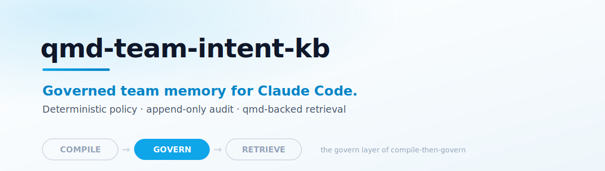

<p align="center">
  <picture>
    <source media="(prefers-color-scheme: dark)" srcset="assets/banner-dark.svg">
    
  </picture>
</p>

# qmd-team-intent-kb

**A governed team memory platform for Claude Code powered by qmd.**

Turn ephemeral Claude Code session insights into persistent, governed, team-wide memory. qmd-team-intent-kb captures institutional knowledge generated during AI-assisted development, applies deterministic governance policies, and makes curated knowledge searchable through qmd's local full-text indexing.

> **Part of the [Compile-Then-Govern](https://github.com/intent-solutions-io/bobs-big-brain-umbrella) stack (Bob's Big Brain)** — INTKB is the **govern** layer. Upstream, [intentional-cognition-os](https://github.com/jeremylongshore/intentional-cognition-os) (compile) emits the spool it consumes; downstream, [qmd](https://github.com/tobi/qmd) (retrieve) serves the curated result with `qmd://` citations. → [Ecosystem overview](https://github.com/intent-solutions-io/bobs-big-brain-umbrella)

## Positioning

This project has a clear separation of responsibilities:

- **qmd** is one of two local retrieval backends. It does one thing well: fast, offline full-text search.
- **qmd-team-intent-kb** provides everything around it: orchestration, governance, lifecycle management, deduplication, analytics, the team-shared memory model, and hybrid retrieval — the qmd binary fused with a native in-process FTS5 (BM25) backend via deterministic reciprocal-rank fusion, then reranked by freshness and category. Serving stays model-free and deterministic; a semantic (sqlite-vec) backend is deferred behind the retrieval eval gate.
- **Enterprise-capable from day one.** Tenant isolation, audit trails, and governance policies are architectural requirements, not afterthoughts.

## Architecture Thesis

The system is built on a strict information flow with deliberate trust boundaries:

1. **Claude Code proposes memory.** During sessions, Claude Code generates memory candidates — insights, patterns, decisions, and lessons. These are proposals, not facts.

2. **Deterministic code decides what becomes durable team memory.** A policy engine evaluates every candidate against configurable governance rules. Secret filtering, deduplication scoring, relevance evaluation, and tenant isolation are all enforced programmatically. No LLM judgment is involved in promotion decisions.

3. **qmd serves as the local retrieval and index edge engine.** Curated, approved memories are synced to local qmd indexes for fast, offline search. The edge daemon handles replication and conflict resolution.

4. **A canonical memory control plane owns truth, lifecycle, governance, deduplication, and analytics.** The control plane API is the single source of truth for memory state. It manages the full lifecycle: inbox, review, promotion, archival, and supersession.

5. **Git is a mirror, export, and distribution layer — not the canonical database.** The git exporter publishes curated knowledge to git repositories in structured Markdown + frontmatter format. Git enables distribution and versioning, but it is downstream of the control plane.

6. **Default search targets curated knowledge only.** When a developer or Claude Code session queries memory, the default search scope is curated, policy-approved knowledge. This is a deliberate design constraint.

7. **Inbox and archive content must not pollute default search.** Raw candidates in the inbox and retired memories in the archive are excluded from default retrieval. Accessing them requires explicit, intentional queries. This prevents unvetted or stale content from contaminating team knowledge.

## Monorepo Structure

```
qmd-team-intent-kb/
├── apps/                    # Deployable applications
│   ├── api/                 # Control plane REST API (Fastify)
│   ├── curator/             # Memory promotion, dedupe, supersession
│   ├── edge-daemon/         # Local qmd sync daemon
│   ├── git-exporter/        # Git mirror/export
│   ├── mcp-server/          # MCP server — local + team brain tools
│   └── reporting/           # Analytics and lifecycle dashboards
├── packages/                # Shared libraries
│   ├── schema/              # Shared Zod schemas and domain types
│   ├── qmd-adapter/         # Fused qmd + native FTS5 retrieval, eval harness
│   ├── claude-runtime/      # Claude Code session capture
│   ├── policy-engine/       # Memory governance policy evaluation
│   ├── eval-surface/        # Govern-decision + provenance CI evals
│   ├── repo-resolver/       # Multi-repo context resolution
│   └── common/              # Shared utilities
├── kb-export/               # Git-exported curated knowledge output
├── 000-docs/                # Project documentation and RFCs
├── examples/                # Usage examples and templates
├── scripts/                 # Build and maintenance scripts
├── tests/                   # Integration tests (repo root)
└── .github/                 # CI/CD workflows and templates
```

### Applications

| Package             | Purpose                                                                                                                                                                                                                                                                                                                                                   |
| ------------------- | --------------------------------------------------------------------------------------------------------------------------------------------------------------------------------------------------------------------------------------------------------------------------------------------------------------------------------------------------------- |
| `apps/api`          | Control plane REST API. Memory CRUD, search delegation, governance admin, authentication. The central authority for canonical memory state.                                                                                                                                                                                                               |
| `apps/curator`      | Memory promotion engine. Validates candidates against policy, deduplicates, detects supersession, assigns lifecycle states.                                                                                                                                                                                                                               |
| `apps/edge-daemon`  | Local sync daemon with spool watch, curation cycle, staleness sweep, PID locking, and graceful shutdown. Replicates to local qmd indexes.                                                                                                                                                                                                                 |
| `apps/git-exporter` | Publishes curated knowledge to git repos in structured Markdown + frontmatter. Incremental export only.                                                                                                                                                                                                                                                   |
| `apps/mcp-server`   | MCP server exposing the brain to Claude Code. Read tools (`teamkb_search`, `teamkb_status`, `teamkb_neighbors`) always register; write tools (`teamkb_propose`, `teamkb_import`, `teamkb_transition`, `teamkb_sync`) are admin-gated. Runs local (in-process qmd) or team mode (proxy to the remote brain over the tailnet when `TEAMKB_API_URL` is set). |
| `apps/reporting`    | Analytics, lifecycle reporting, governance audit trails, and team knowledge dashboards.                                                                                                                                                                                                                                                                   |

### Libraries

| Package                   | Purpose                                                                                                                                                                                                                                                                                        |
| ------------------------- | ---------------------------------------------------------------------------------------------------------------------------------------------------------------------------------------------------------------------------------------------------------------------------------------------- |
| `packages/schema`         | Shared Zod schemas and derived TypeScript types for the entire domain model. Single source of truth for data shapes.                                                                                                                                                                           |
| `packages/qmd-adapter`    | Hybrid retrieval. Fuses the qmd binary with a native in-process FTS5 (BM25) backend via reciprocal-rank fusion (RRF, k=60), reranks by freshness + category, and enforces curated-only default search. Ships the Recall@10 / nDCG@10 stratified eval harness that gates ranking changes in CI. |
| `packages/claude-runtime` | Captures memory proposals from Claude Code sessions. Hooks into session events, applies pre-policy secret filtering.                                                                                                                                                                           |
| `packages/policy-engine`  | Evaluates candidates against governance rules. Secret detection, dedup scoring, relevance, tenant isolation. All deterministic. Ships a recommended full-coverage policy + an anti-dormancy gate that flags uncovered rule types.                                                              |
| `packages/eval-surface`   | Deterministic evaluation surface — govern-decision precision/recall (fail-closed on a missed secret/PII) and provenance-integrity evals, run as named CI gates.                                                                                                                                |
| `packages/store`          | SQLite persistence layer via better-sqlite3. WAL mode, 7 repository classes, in-memory test database helper. Enum-membership backstop + CHECK constraints on `curated_memories`; lifecycle state-graph enforced at the write path.                                                             |
| `packages/repo-resolver`  | Multi-repo context resolution. Determines project/team ownership and enforces tenant boundaries.                                                                                                                                                                                               |
| `packages/common`         | Shared utilities: Result<T, E> type, SHA-256 content hashing, path-safety validation, freshness scoring with reranking.                                                                                                                                                                        |

## Status

**v0.7.0 — Production-ready platform with full Intent Solutions Testing SOP enforced in CI.**

**v0.7.0 marquee:** hybrid retrieval — the qmd binary fused with a native in-process FTS5 (BM25) backend via reciprocal-rank fusion (RRF, k=60), reranked by freshness + category, model-free · a stratified Recall@10/nDCG@10 eval harness that gates ranking changes in CI · MCP tool surface (`teamkb_search` / `teamkb_status` / `teamkb_neighbors` read; `teamkb_propose` / `teamkb_transition` write, admin-gated) with local and team-brain modes · hash-chained tamper-evident audit receipts with an external chain-head anchor.

All core subsystems functional. 1,900+ unit tests + a testcontainers-based L4 integration suite (postgres forward-compat) passing. The per-PR CI (`ci.yml`) enforces: format → lint → typecheck → architecture (dependency-cruiser) → complexity (CRAP) → policy-artifact hash pin (`harness-pin --verify`) → unit tests + coverage (80% line / 70% branch) → govern-decision & provenance-integrity evals → retrieval ratchet (stratified Recall@10) → L4 integration (testcontainers). Weekly/nightly workflows (`security.yml`, `nightly.yml`) add gitleaks, Semgrep, and npm audit. Policy artifacts are hash-pinned via `scripts/harness-pin.sh` so the testing SOP is self-defending against silent AI policy edits.

Highlights:

- **Schema & Domain Model** — Zod schemas, lifecycle state machine, 12 enum types (Phase 1)
- **Claude Runtime Capture** — Session capture, local JSONL spool, 11-pattern secret detection (Phase 2)
- **qmd Adapter** — CLI wrapper, curated-only default search, tenant-isolated indexes (Phase 3)
- **Policy Engine** — 8 deterministic rule evaluators with short-circuit pipeline (Phase 4A)
- **SQLite Store** — 5 repositories, WAL mode, in-memory test support (Phase 4B)
- **Control Plane API** — Fastify 5, candidate intake, memory lifecycle, policy CRUD, audit trail (Phase 4C)
- **Curator Engine** — Spool intake, dedup, Jaccard supersession detection, dry-run mode (Phase 5)
- **Git Exporter** — Incremental Markdown export, YAML frontmatter, category routing (Phase 6)
- **Reporting** — Lifecycle analytics, aggregators, formatters (Phase 7)
- **Security Hardening** — API middleware (rate-limiter, auth, input sanitizer), content classifier, export gating, path-safety (Phase 8)
- **Repo Resolver** — Multi-repo context resolution with monorepo detection, tenant derivation, and caching (Phase 9)
- **OpenAPI Documentation** — Generated OpenAPI 3.1 spec at `/openapi.json` and Swagger UI at `/docs` (Phase 10)
- **Supply-Chain Security** — Cosign keyless signing + SLSA Level 3 provenance for container images (Phase 10)
- **Hybrid Retrieval** — qmd binary fused with a native FTS5 (BM25) backend via reciprocal-rank fusion (RRF, k=60), freshness + category rerank, and a stratified Recall@10/nDCG@10 eval ratchet gating ranking changes in CI (semantic sqlite-vec path deferred behind the eval gate)
- **MCP Server** — local + team-brain tool surface for Claude Code; read tools always register, write tools are admin-gated, team mode proxies the remote brain over the tailnet
- **Govern Hardening** — write-time enum-membership backstop + CHECK constraints on curated memories, lifecycle state-graph enforcement, sensitivity persisted at promotion and enforced at read time (curated search never returns confidential/restricted memories), fail-closed export category mapping, spool `schemaVersion` validation, and an anti-dormancy policy-coverage gate

## Getting Started

### Prerequisites

- Node.js 20+
- pnpm 9.15+

### Setup

```bash
# Clone the repository
git clone https://github.com/jeremylongshore/qmd-team-intent-kb.git
cd qmd-team-intent-kb

# Install dependencies
pnpm install

# Run the full validation suite (format, lint, typecheck, test)
pnpm validate
```

### Available Scripts

| Script              | Description                                   |
| ------------------- | --------------------------------------------- |
| `pnpm validate`     | Run all checks: format, lint, typecheck, test |
| `pnpm lint`         | Run ESLint                                    |
| `pnpm format:check` | Check Prettier formatting                     |
| `pnpm typecheck`    | Run TypeScript compiler checks                |
| `pnpm test`         | Run Vitest test suite                         |
| `pnpm build`        | Build all packages (tsc -b composite build)   |
| `pnpm clean`        | Remove all build artifacts and node_modules   |

## Contributing

See [CONTRIBUTING.md](./CONTRIBUTING.md) for branching model, commit conventions, PR expectations, and development workflow.

## Security

See [SECURITY.md](./SECURITY.md) for vulnerability reporting, threat model, and security practices.

## License

[Apache License 2.0](./LICENSE) -- Copyright 2026 Jeremy Longshore
